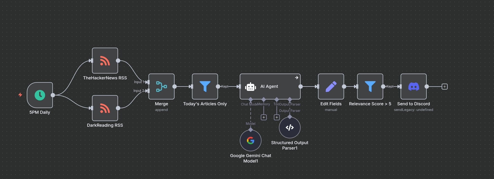
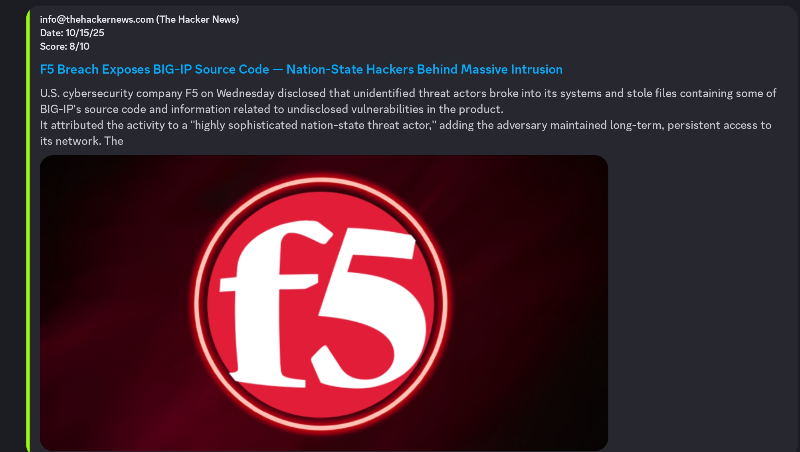

# AI Newsletter Curator (n8n Workflow)

A simple n8n workflow that uses an LLM to monitor RSS feeds for tech news, scores articles based on relevance, and sends a daily summary to a Discord server.

## The Problem

I wanted a centralized, automated way to receive a curated digest of news that truly interests me, delivered to a Discord server I already use for other notifications.

## The Solution

To solve this, I built an automation in n8n that acts as a personal news curator. This workflow runs daily, grabbing the latest articles from my preferred RSS feeds. It then uses a Large Language Model (LLM) to analyze each article and assign a relevance score based on my interests, such as breaking news and unique insights. Finally, it sends a formatted summary of only the top-scoring articles directly to a Discord channel.

## Features

- **Daily Aggregation**: Fetches the latest articles from multiple RSS feeds every day.
- **AI Filtering**: Uses an LLM to analyze and score each article's relevance on a 1-10 scale.
- **Custom Filtering**: Only proceeds with articles that meet a minimum relevance score.
- **Instant Notifications**: Sends a formatted Discord Embed for each relevant article, with a title, summary, author, and link.

## Workflow Breakdown

- **Trigger (Schedule Node)**: Activates every day at a set time (e.g., 5 PM).
- **Fetch (RSS Feed Nodes)**: Gathers the latest articles from specified news sources like The Hacker News and Dark Reading.
- **Combine & Filter (Merge & Filter Nodes)**: The articles from all feeds are combined and then filtered to ensure only articles published on the current day are processed.
- **Score (LLM Agent Node)**: The content of each article is sent to an LLM with a prompt, asking it to return a relevance score from 1-10 based on predefined criteria.
- **Format (Edit Fields Node)**: The LLM's score is combined with the article's original data (title, author, link, image) into a structured JSON object.
- **Condition (Filter Node)**: The workflow continues only if an article's relevance score is above a set threshold (e.g., greater than 5).
- **Notify (Discord Node)**: The formatted JSON for each high-scoring article is sent to a Discord webhook URL, appearing as an embed in the server.

## Setup & Installation

1. **Get the Workflow**:
[Add link to your workflow JSON file here]
2. **Import to n8n**:
    - Open your n8n canvas.
    - Go to `File` > `Import from File...`
    - Select the downloaded `workflow.json`.
3. **Configure Credentials**:
    - You will need to create and add credentials in n8n for your **LLM Provider** (e.g., Google Gemini, OpenAI) to provide your API key.
4. **Configure Nodes**:
    - **RSS Feed Nodes**: You can change the URLs in these nodes to your own preferred news sources.
    - **LLM Node**: Select your LLM credentials and ensure you select the correct model.
    - **Filter Node ("Relevance Score > 5")**: You can adjust the score (e.g., change `5` to `7`) to make the filter more or less strict.
    - **Discord Node**:
        - Create a webhook in your Discord server (`Server Settings` > `Integrations` > `Webhooks`).
        - Copy the Webhook URL.
        - Paste the URL into the `Webhook URL` field in the n8n node.
5. **Activate**:
    - Save the workflow and toggle it to **Active**.

## Example Output (Discord Embed)

When a relevant article is found, a message like this will appear in your Discord channel:

## About This Project

This was a personal project to practice integrating AI into automated workflows. It solves a simple yet common problem by automating the process of searching and filtering news articles. I hope you find it useful too!
